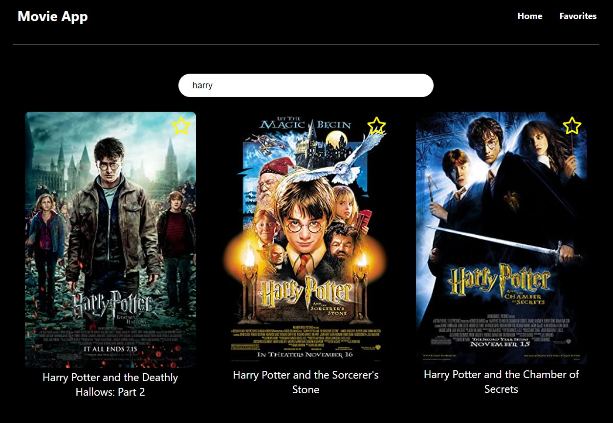
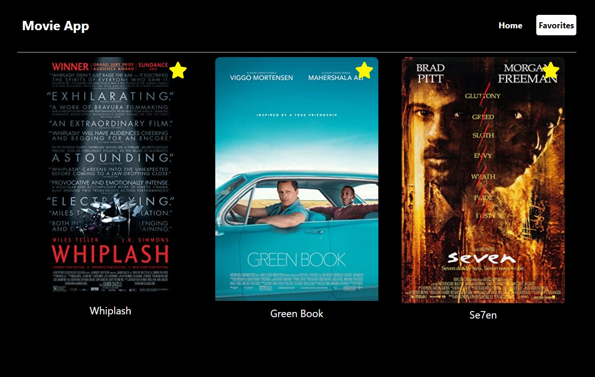

# Movie Search App

This project is a React application with functions to search for movies and add movies to favorites using OMDb API.

# Home Page

  

# Favorites Page

  

# Detail Page

  

# Project setup

### `npm install`

# Project start

### `npm run start`
